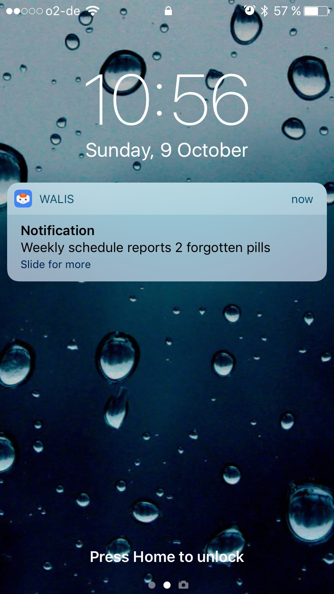

# WALIS App

Last revision: `09.10.2016` by [ @marc-fiedler ]

|||
|---|---|
|Language|Objective-C|
|Authors|Marc Fiedler|
|License|MIT|
|runs on|XCode 8.0 / iOS 8.4+|
|Robot Repository|https://github.com/IBM-Hackathon/walis|

## Basic idea
The Walis App for iOS has been designed to make it easy to interact with robots directly from a remote location. The robot Walis can send silent and active push notifications to one specific or a range of iOS devices. Silent notifications are ment to create a history of events that happend and active push notifications are ment for alerts or warnings.




## API

The API interface obeys the Ophion API rules. That means the package will automatically create an endpoint that is reachable by Package name (e.g. "beckroege"). The endpoint will accept the following requests:

* Request device list (devices.handler)
* Request all posts (post.handler)
* Register new device (register.handler)
* Ping request (ping.handler)
* Push a Notification to device(s) (push.handler)

> Important note:

> Usually the communication between client and server have an exta layer of security but for this demo this layer has been disabled.

For a complete set of calls please visit the Wiki of this repository  

### Example Request

```json
{
    "Request": "Devices",   
    "Api": {
        "Version": "4.0"
    }
}
```

The API will reply with HTTP response codes. On Success the API will answer with 200 and a Status array that contains a Message string. On Error the API will return the appropriate HTTP response code and an additional Status array containing a Message string.

### Example Reply Success
```json
{
  "Api": {
    "Version": "4.0"
  },
  "Time": 1475068534,
  "Status": {
    "Package": "Beckroege App",
    "Type": 1,
    "Message": "Pong"
  },
  "Warning": {
    "Message": "The api major version [3] you are using is depricated. Current is: 4.0"
  }
}
```

### Example Reply Error

```json
{
  "Api": {
    "Version": "4.0"
  },
  "Time": 1475069689,
  "Status": {
    "Code": 406,
    "Message": "Invalid Ophion-Interface"
  }
}
```

## Contact
Feel free to drop me a message at mf (at) blackout-tech (dot) org
